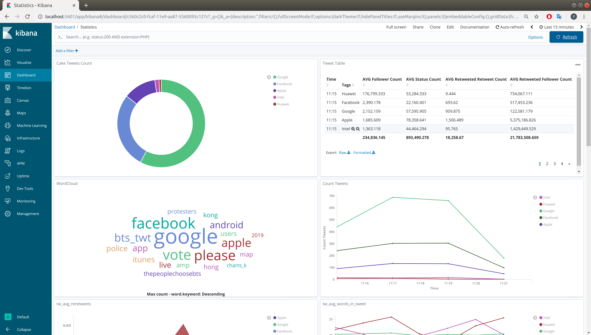
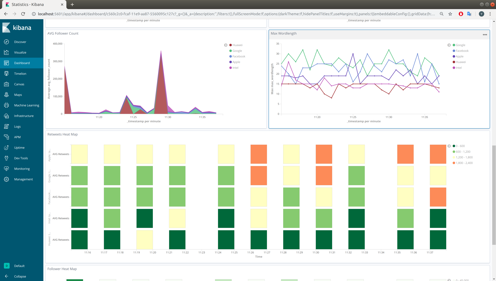
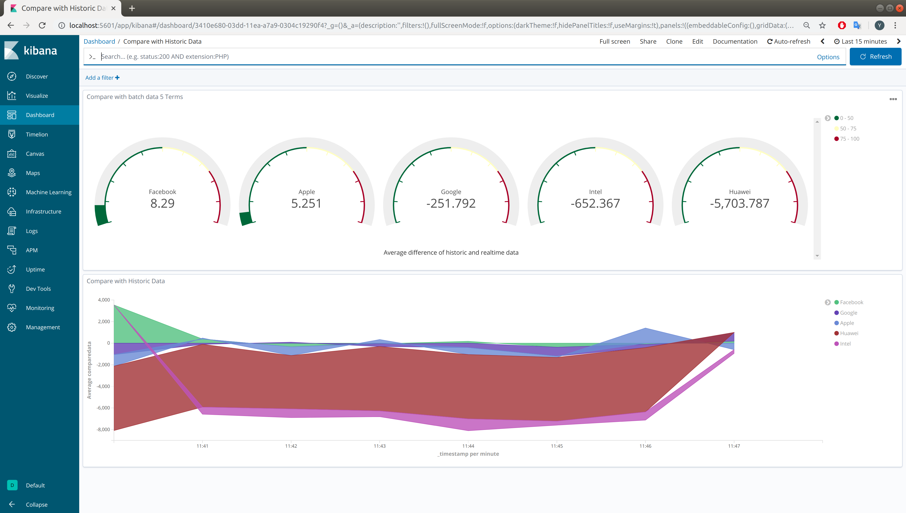
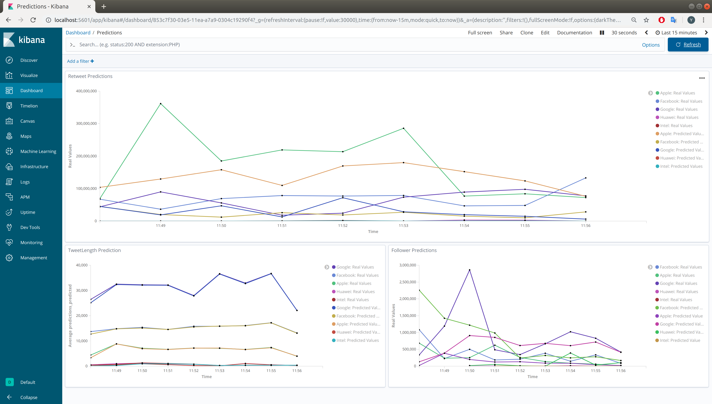
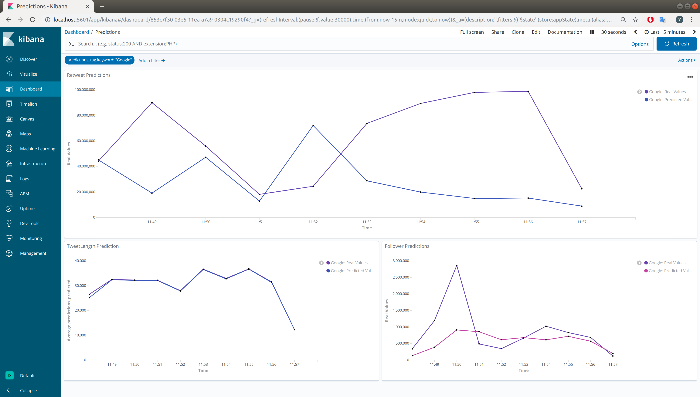

# Twitter Flink Project 
## Hashtags 
- I used the Hashtags of "Google", "Facebook", "Apple", "Intel" and "Huawei" to Compare big tech companies.

## Structure
- I used Elasticsearch and Kibana(6.8.4) for the visualisation
    - Statistics Dashboard (with all general visualisations)
    - Compare with Historic Data (Difference of historic Data and realtime streaming Data)
    - Prediction Dashboard (Predictions with Predicted Values and Real Values)
- The Twitter Stream and mapping to the DataClass is done in TweetStream.java
- The Streaming and all the streaming statistics are done in the TwitterStreamJob.java
    - writes data to elasticsearch and to a local storage sink
- The historic implementation is in BatchTwitter.java
    - reads files from local storage
    - writes result to local storage
- The Comparision is in CompareBatchWithStreaming.java
    - writes results to elasticsearch
- The Predictions are done in TwitterStreamPredictions.java
    - writes results to elasticsearch
- Video: https://youtu.be/9g-4a8KblCY

## Get started
- You need to download elasticsearch 6.8.4 and kibana 6.8.4 
- First start elastic search then kibana with: 
    ```
  $ ./elasticsearch-6.8.4/bin/elasticsearch
  $ ./kibana-6.8.4-linux-x86_64/bin/kibana
    ```
    - for Kibana to recognize the timestamps I used a workaround and added a scripted field with the type date and the input of a Long timestamp (doc['createdAt'].value)
- if you use Intellij you have to reimport the pom.xml to import all maven repositories
- After that you can start the Jobs

## Visualisations
### Statistics:


## Compare Statistics:

## Prediction Visualisation




### Submission of the project
Students are expected to submit the following materials:
- source code with comments
- README file: how to compile and run the solution, explanation of the solution (ideally up
to 1 page)
- Demo (screen recording for running the project)
- no number of lines is required as long as one can follow the code, understand the solution
and lunch the project without herculean efforts :)
Students have the option to submit the project for feedback (2 weeks before final submission
and will receive the comments which they can address during the last week)
Detailed workload estimation


1) Twitter connection and data collection (+ understanding the example) - 5 hours
2) Create the data collection for online and historic analysis - 2 hours
3) Create the stream (online) metric computation implementation - 5 hours
4) Create the batch(historic) metric computation implementation - 5 hours
5) Compare the online statistics with the offline computed statistics - 3 hours
6) Study options for making predictions about 3 statistics - 6 hours
7) Create a visualization and prepare the demo (GUI, batch, excel....) -3 hours
8) Prepare the demo submission - 1 hour
9) Solve various bugs that appear along the way - 3 hours (10% of the workload :) )
